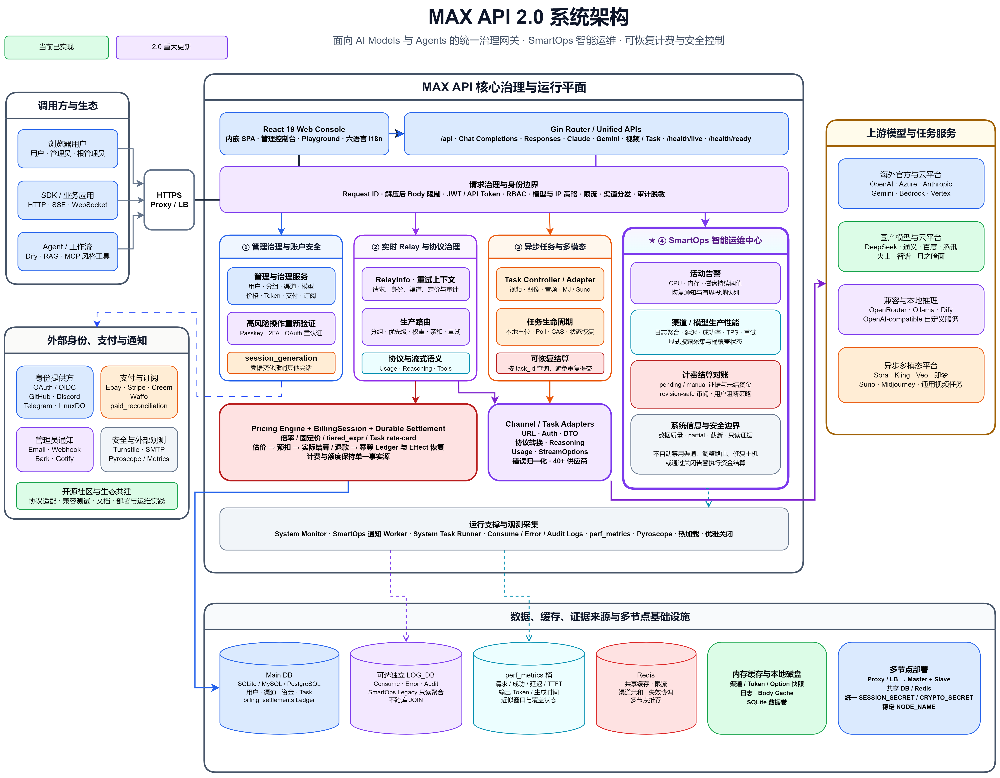

# MAX API

<div align="center">


**AGI アプリケーション時代に向けた AI Models and Agents governance、インテリジェント運用、オープンコラボレーション基盤**

**MAX API 2.0：インテリジェント運用の時代へ · 統一モデルゲートウェイから AGI ネイティブなガバナンス／運用基盤へ**

[MAX API 2.0 Preview リリースノートを見る](https://github.com/MAX-API-Next/MAX-API/releases/tag/v2.0.0-smartops.pre1)

<p align="center">
  <a href="./README.zh_CN.md">简体中文</a> |
  <a href="./README.zh_TW.md">繁體中文</a> |
  <a href="./README.en.md">English</a> |
  <a href="./README.fr.md">Français</a> |
  <strong>日本語</strong>
</p>

<p align="center">
  <a href="https://raw.githubusercontent.com/MAX-API-Next/MAX-API/main/LICENSE">
    
  </a><!--
  --><a href="https://github.com/MAX-API-Next/MAX-API/releases/latest">
    
  </a><!--
  --><a href="https://hub.docker.com/r/cscitechtop/max-api">
    
  </a><!--
  --><a href="https://goreportcard.com/report/github.com/MAX-API-Next/MAX-API">
    
  </a>
</p>

<p align="center">
  <a href="https://github.com/MAX-API-Next/MAX-API"><strong>⭐ Star を付ける</strong></a> •
  <a href="#-max-api-next-コミュニティに参加"><strong>💬 コミュニティに参加</strong></a> •
  <a href="https://docs.max-api.ai"><strong>📚 ドキュメント</strong></a> •
  <a href="https://github.com/MAX-API-Next/MAX-API/releases"><strong>🚀 リリース</strong></a>
</p>

<p align="center">
  <a href="#-max-api-next-コミュニティに参加">コミュニティ</a> •
  <a href="#-クイックスタート">クイックスタート</a> •
  <a href="#-max-api-が必要な理由">MAX API の価値</a> •
  <a href="#-agi-に向けた技術方針">AGI 技術方針</a> •
  <a href="#-現在の機能">現在の機能</a> •
  <a href="#-インテリジェント運用センター">SmartOps</a> •
  <a href="#-本番デプロイ">本番デプロイ</a>
</p>

</div>

---

MAX API は、アプリケーションや Agent と上流モデルサービスの間に位置する、統一モデルゲートウェイ、ガバナンス制御プレーン、運用エントリーポイントです。MAX-API-Next コミュニティは、実践的な AGI エンジニアリングを中心に本プロジェクトを継続的に開発し、開発者、研究者、企業のエンジニアリングチーム、大学の技術愛好者、オープンソース貢献者に協働の場を開いています。私たちの目標は、AGI アプリケーションが実際に必要とするモデル接続、権限、コスト、Evidence、インテリジェント運用、安全制御の基盤を構築することです。

AGI の領域で、私たちは **先進的かつ検証可能な技術を継続的に提供し、実際の本番課題をオープンなエンジニアリング能力へ変え、共同研究と貢献のためのコミュニティを築きます。**

## 🌐 MAX-API-Next コミュニティに参加

MAX API は単なるコードリポジトリではありません。AI Models、Agents、AgentOps、AGI エンジニアリングを対象とした長期的なオープンコラボレーションです。モデルゲートウェイの運用、Agent の開発、新しいモデルの適応、評価とガバナンスの研究、ドキュメントや翻訳の改善など、どのような形でもコミュニティへの参加と貢献を歓迎します。

**コミュニティに参加すると、リリース、モデルやプロトコルの変更、デプロイの実践、トラブルシューティングの知見、共同開発の機会をより早く得られます。**

<p align="center">
  <strong>QQ グループ：950126533</strong> •
  <strong>WeChat グループ：MAX-API を検索</strong>
</p>

| コミュニティ窓口 | 用途 |
|---|---|
| [MAX-API-Next GitHub](https://github.com/MAX-API-Next) | コミュニティプロジェクト、技術方針、オープンコラボレーションをフォロー |
| [MAX API Issues](https://github.com/MAX-API-Next/MAX-API/issues) | 再現可能な問題、改善提案、互換性の変化を共有 |
| [MAX API Releases](https://github.com/MAX-API-Next/MAX-API/releases) | 正式版と Preview 版の更新を確認 |
| [Ask DeepWiki](https://deepwiki.com/MAX-API-Next/MAX-API) | コードベースをすばやく検索・理解 |
| 技術・エコシステム連携 | `maxapi@max-api.ai` まで連絡 |

### 求めている貢献者

- **モデル／プロトコル貢献者**：新しいモデルやプロバイダー、Reasoning、ツール呼び出し、マルチモーダルタスクプロトコルの適応。
- **Agent／アプリケーション開発者**：Dify、RAGFlow、Codex、MCP、ワークフロー、研究 Agent の接続・ガバナンス事例の共有。
- **信頼性／セキュリティエンジニア**：複数データベースのテスト、非同期タスク復旧、精算安全性、キャッシュ整合性、権限境界の強化。
- **ドキュメント／コミュニティ貢献者**：デプロイガイド、FAQ、事例、翻訳、再現可能な実験、新規貢献者向けガイドの改善。
- **研究者／評価開発者**：Evidence、Evaluator、Detector、Runbook、制御された自律性の設計。

<details>
<summary><strong>共同開発の領域、原則、参加方法を見る</strong></summary>

| 共同開発領域 | 貢献例 |
|---|---|
| モデル／プロバイダーエコシステム | モデル・プロトコルアダプター、互換性テスト、モデル一覧や廃止情報、チャネル設定テンプレート |
| AgentOps と AGI アプリケーションガバナンス | Agent 接続例、トークンと権限の境界、コストガバナンス、運用プラクティス |
| SmartOps と Evidence | 匿名化した障害事例、メトリクス定義、アラートルール、データ品質説明、診断・評価手法 |
| 信頼性、課金、セキュリティ | 冪等精算、非同期復旧、複数データベース回帰テスト、キャッシュ整合性、高リスク操作の検証 |
| ドキュメント、チュートリアル、国際化 | デプロイ、アーキテクチャ、FAQ、事例、翻訳、新規貢献者ガイド |

可能な限り、最小再現、バージョン、環境、匿名化したログ、またはテスト証拠を提供してください。プロトコル、データベース、ユーザー契約を変更する場合は、互換性、移行、ロールバック手順を明記してください。実際の API Key、顧客データ、決済の生データ、非公開ログ、許可されていないデータを送信しないでください。資金、セキュリティ、秘密情報、本番データ、自動実行に関わる貢献には、より厳格なテスト、独立レビュー、明確な責任者が必要です。

次の方法から始められます：

1. 再現可能な問題、プロトコル差分、モデル互換性の変化を報告する。
2. 既存 Issue に失敗テスト、複数データベースのケース、フロントエンド回帰、匿名化した Evidence を追加する。
3. モデル／チャネル設定、デプロイ手順、FAQ、アーキテクチャ、翻訳を改善する。
4. 匿名化した Agent 接続、コストガバナンス、SmartOps、プライベートデプロイの実践を共有する。
5. 能力境界とリスクを明示した Evaluator、Detector、Runbook、制御された自律性の設計を提案する。

</details>

関連ドキュメント：[MAX-API-Docs](https://github.com/MAX-API-Next/MAX-API-Docs)（デプロイ、設定、利用ガイド）。

モデルプロバイダー、Agent／ワークフロープロジェクト、オープンソースコミュニティ、研究者、企業エンジニアリングチームとの技術協働を歓迎します。正式な提携、共同発表、機関名の使用には、双方の明示的な承認が必要です。

> [!IMPORTANT]
> 一般向けに生成 AI サービスを提供する場合、運営者は管轄地域で求められる上流認可、届出・許可、コンテンツ安全、本人確認、ログ保存、税務、決済、利用規約などの義務を自ら履行する必要があります。ログ監査やコンテンツ保存は、法的根拠、明確な通知、権限分離、適切なデータセキュリティ対策がある場合にのみ有効化してください。


## 🧠 AGI に向けた技術方針

AGI アプリケーションは、単一モデル、単一プロトコル、単発リクエストだけに依存し続けることはありません。複数モデルにまたがる推論、ツール呼び出し、マルチモーダルタスク、長時間実行、コスト制約、本番 Evidence、回復可能な失敗処理が必要です。MAX API は、これらの検証可能なエンジニアリング課題から AI Models and Agents governance の基盤を構築します。

| 技術方針 | 現在の基盤 | AGI アプリケーションへの価値 |
|---|---|---|
| マルチモデル／マルチプロトコル接続 | OpenAI Compatible、Responses、Claude Messages、Gemini、Realtime、マルチモーダルおよび非同期タスクプロトコル | モデルエコシステムが変化しても、アプリケーションと Agent に比較的安定した入口を提供 |
| 推論／ツールコンテキスト互換性 | Reasoning Effort、ツール定義、Tool Call、ツール応答の関連付け、マルチターンコンテキスト変換 | プロバイダー切り替え時の推論情報やツール意味論の損失を軽減 |
| ガバナンス制御プレーン | ユーザー、トークン、モデル範囲、グループ、ルーティング、レート制限、クォータ、価格、管理者権限 | Agent、環境、タスクごとに独立したアイデンティティ、アクセス、予算の境界を作成 |
| 回復可能な課金とタスクライフサイクル | 事前課金、最終精算、冪等記録、失敗時返金、非同期ポーリング、手動照合状態 | 長時間タスク、リトライ、障害ウィンドウでの重複請求、誤返金、追跡不能な結果を防止 |
| Evidence とインテリジェント運用 | ログ、エラー、リトライ、性能バケット、アクティブアラート、チャネル／モデル性能、精算証拠 | 診断、評価、将来の Agent 提案を、プロンプトだけでなく追跡可能な事実に基づかせる |
| セキュリティ／組織ガバナンス | Passkey、2FA、スコープ別再認証、セッション失効、監査、機密操作のレート制限 | 高リスク設定、認証情報、運用操作に明確な責任境界を保持 |
| 制御された自律性とエンジニアリング進化 | **長期ビジョン**：Policy、Budget、Approval、Shadow、Canary、Rollback、分離された Coding Workspace | 自動化を評価・制約・監査してから、低リスクの本番操作へ段階的に導入 |

### 技術原則

- **Evidence before Action**：診断、提案、自動操作の前に、検証可能な事実を確立する。
- **Governance before Autonomy**：アイデンティティ、権限、予算、承認、監査、ロールバックを自律機能より先に整備する。
- **One Billing Truth**：本番課金、クォータ、精算は単一の事実源を維持し、Agent やプラグインに第二の会計ロジックを作らない。
- **Compatibility by Design**：SQLite、MySQL、PostgreSQL、複数プロバイダープロトコル、移植可能なアプリケーション契約を継続的にサポートする。
- **Open Collaboration, Safe Boundaries**：プロトコルアダプター、テスト、ドキュメント、評価、ガバナンス設計を公開し、高リスクの本番、資金、秘密情報、リリース操作は明示的な承認下に置く。

### MAX API 2.0 の技術的ハイライト

- **Evidence-driven SmartOps**：リソースアラート、チャネル／モデル性能、データ品質状態、課金精算 Evidence を一つの運用入口に集約し、人によるレビューと実際の財務状態の境界を維持します。
- **高度なモデルプロトコルへの継続対応**：Responses、Claude Messages、Gemini、Ollama における Reasoning、キャッシュキー、ペナルティパラメータ、ツール定義、マルチターン Tool Context の互換性を強化します。
- **回復可能な課金／非同期タスク意味論**：冪等 settlement、永続 effect、タスク ID、明示的な pending/manual 状態により、異常リトライによる重複請求、誤返金、タスク消失を防ぎます。
- **高リスク操作のスコープ別再認証**：Passkey、2FA、Telegram、API Token、セッション失効は scope-bound step-up verification を使用し、`session_generation` によって古いセッションを速やかに無効化します。
- **複数データベース対応と継続的検証**：主要データパスは SQLite、MySQL、PostgreSQL に対応します。Go テスト、フロントエンド Bun テスト、TypeScript 型チェック、JSON ラッパールール、テストミラー同期がリリースゲートを構成します。

## 💡 MAX API が必要な理由

| 観点 | 複数プロバイダーへの直接接続 | MAX API を使用 |
|---|---|---|
| アプリケーション接続 | SDK、プロトコル、認証、エラー形式を個別に保守 | アプリケーション側は比較的安定した統一入口を使用 |
| モデル切り替え | コード、秘密情報、デプロイ設定を変更 | チャネル、モデルマッピング、グループ、ルーティングで調整 |
| 可用性 | 各アプリケーションがリトライと上流障害を処理 | 重み、優先度、失敗時リトライ、切り替えを集中設定 |
| 権限／秘密情報 | 認証情報がアプリケーションや環境変数に分散 | トークン、モデル範囲、クォータ、有効期限を集中管理 |
| コスト管理 | 複数社の請求が分散し帰属が困難 | ユーザー、トークン、モデル、チャネル、グループ別に集計 |
| トラブルシューティング | ログがプロバイダーごとに分散 | ゲートウェイでリクエスト、エラー、リトライ、レイテンシを統一観測 |

一言で表すと、**プロバイダーはモデルを提供し、Agent フレームワークはアプリケーションをオーケストレーションし、MAX API は統一アクセスとガバナンス境界を担います。**

## 🚀 クイックスタート

ローカル環境ではデフォルトで SQLite を使用し、必要なのは Docker だけです：

```bash
MAX_API_IMAGE=cscitechtop/max-api:latest@sha256:006d5d86887a261baab4d71ec3797d429e3771a4836e5899734aee0e7f66f2ab

docker pull "$MAX_API_IMAGE"

docker run --name max-api -d --restart always -p 3000:3000 -e TZ=Asia/Shanghai -v ./data:/data "$MAX_API_IMAGE"
```

<http://localhost:3000> を開き、次の操作を行います：

1. 管理者アカウントを作成または確認する。
2. 正当な利用権限を持つ上流チャネルと API Key を追加する。
3. アクセストークンを作成し、アプリケーションの Base URL を MAX API に向ける。

> [!TIP]
> 本番環境では正式版を使用してください。Preview 版はテストと段階的検証向けです。アップグレード前にデータベースをバックアップし、ロールバック手順を準備してください。
>
> [!WARNING]
> SQLite はローカル評価、開発、小規模テスト向けです。本番環境では、ベンダーのセキュリティサポート期間内にある MySQL（8.4 LTS 推奨）または PostgreSQL（14+ 推奨）を使用し、Redis、HTTPS、バックアップ、復旧手順を構成してください。互換性の下限は MySQL ≥ 5.7.8、PostgreSQL ≥ 9.6 ですが、これらのバージョンを本番で使用することは推奨しません。

## ✨ 現在の機能

現在のシステムでは、次の機能を提供しています：

| 機能 | 主な用途 |
|---|---|
| 統一モデル入口 | OpenAI Compatible、Responses、Claude Messages、Gemini、Realtime、マルチモーダルタスク API を接続 |
| マルチプロバイダールーティング | チャネル、重み、優先度、グループ、モデルマッピング、リトライ、プロバイダー間切り替えを管理 |
| アイデンティティ／アクセス制御 | ユーザー、トークン、モデル範囲、グループ、クォータ、有効期限、レート制限、管理者権限を管理 |
| コスト／課金 | 倍率、固定価格、式ベース課金、非同期タスク rate-card、事前課金、精算、失敗時返金 |
| ログ／監査 | ユーザー、トークン、モデル、チャネル、グループ、ノード別に利用、エラー、リトライ、管理操作を確認 |
| インテリジェント運用センター | アクティブアラート、チャネル／モデル性能、システム情報、課金精算照合 Evidence を一元確認 |
| プライベートデプロイ | SQLite、MySQL、PostgreSQL、Redis、複数ノード、独立ログデータベース |
| 上流拡張性 | プロトコルアダプター、パス、パラメーター／Header の上書き、モデル発見、タスク状態マッピング |

### 利用シーン

- **チーム／組織内モデルゲートウェイ**：ユーザー、トークン、モデル、プロバイダー、権限、費用を一元管理。
- **AI アプリケーション／Agent の実行基盤**：アプリケーション、Agent、ワークフローにモデルアクセス制御、コスト帰属、障害診断を提供。
- **マルチプロバイダーの冗長化と移行**：モデルマッピング、重み付きルーティング、リトライ、段階的切り替えで単一上流への依存を軽減。
- **マルチモーダルタスクガバナンス**：画像、音声、動画、埋め込み、リランキング、リアルタイム会話 API を統一管理。
- **プライベート／コンプライアンス運用**：秘密情報、データ、ログ、監査、価格、デプロイ環境を自主管理。

## 🩺 インテリジェント運用センター

**インテリジェント運用センターは MAX API 2.0 の主要アップデートであり、統一モデルゲートウェイから AGI ネイティブなガバナンス／運用基盤へ進む重要な一歩です。**

本番観測、リソースアラート、モデル／チャネル性能、システム情報、課金精算照合を一つの管理者入口に集約します。現在の機能は「問題を可視化する、証拠を残す、管理者に通知する、制御されたレビューを行う」ことに重点を置いています。チャネル、ルーティング、残高、ホストを自動変更する自律 Agent ではありません。

| モジュール | 現在提供する内容 |
|---|---|
| アクティブアラート | 現在のノードで CPU、メモリ、ディスクが閾値を継続超過した場合の重複排除アラートと復旧通知。管理者の既存 Email、Webhook、Bark、Gotify 設定を再利用 |
| チャネル性能 | リクエスト／エラー、消費クォータ、推定成功率、ログレイテンシ、リトライ、プローブレイテンシ、最終観測時刻。詳細では過去 24 時間のモデル／グループ性能を表示 |
| モデル性能 | チャネル数、リクエスト／エラー、消費クォータ、推定成功率、ログレイテンシ、スループット、リトライを集約。詳細ではグループ性能、レイテンシ、可用率の傾向を表示 |
| 課金精算照合 | `pending` / `manual` の正方向最終精算、未精算資金、リトライ、エラー Evidence を表示。ルート管理者はデフォルトのユーザーブロック方針を設定でき、管理者は `id + revision` 単位でアトミックに一括レビューしてアラートを閉じられる |
| システム情報 | ノード、実行インスタンス、システムタスクなどを表示。このモジュールは引き続きスーパー管理者権限が必要 |

アクティブアラート画面は 5 秒ごとに現在の状態を読み取りますが、新たな検出や修復は実行しません。チャネル／モデル一覧はデフォルトで直近 1 時間を検索し、`1–168` 時間のカスタム範囲を指定できます。大規模ログデータベースを自動で繰り返し集計せず、「フィルターを適用」または「更新」を押したときだけ検索し、詳細データは必要時に読み込みます。

課金精算照合は、財務復旧状態と運用アラート状態を厳密に分離します。「レビューして閉じる」は管理者レビューを記録し現在のアラートを閉じるだけで、精算を `applied` に変更せず、残高、適用済み差額、effect 状態も変更しません。一括レビューは現在の財務 revision に拘束されます。更新後に記録が変わった場合、古い選択は自動的に無効となり、古い証拠に基づく操作を防ぎます。

> [!NOTE]
> 現在の本番性能表示は主に既存の Consume/Error ログと `perf_metrics` を集約します。推定成功率は完全な Relay Attempt 成功率ではなく、スループットと傾向は性能バケット単位の近似値です。ログ無効、履歴不足、収集停止、対象期間にサンプルなし、検索失敗の場合、対応するデータ品質状態を表示します。
>
> アクティブアラートは性能監視とリソース閾値設定に依存します。閾値 `0` はそのリソースアラートを無効化し、発火には連続する 2 つの有効サンプルが必要です。状態と通知キューは現在のプロセスメモリだけに保存されるため、再起動後には残らず、複数ノード間で自動的に Incident へ統合されません。チャネル、モデル、システムの観測は読み取り専用です。精算レビューはレビューのメタデータとユーザーブロック方針だけを更新し、資金精算を実行しません。インテリジェント運用センターは、テスト、無効化、重み変更、チャネル切り替え、ホスト修復を自動実行しません。

この段階ではまず「問題を見る、管理者へ通知する、証拠を提示する、制御されたレビューを行う」ループを完成させ、統一 Evidence、診断 Agent、Evaluator、制御された自動化の基盤を作ります。

## 🔌 モデル、インターフェース、拡張性

> 実際に利用できる機能は、上流の利用権限、チャネル設定、モデルマッピング、プロバイダー対応状況に依存します。MAX API はこれらの機能をガバナンスしますが、モデルサービス自体は提供しません。

| カテゴリ | インターフェース／機能 |
|---|---|
| 一般モデル API | Chat Completions、Responses、Embeddings、Rerank、Images、Audio、Video |
| ネイティブ／リアルタイムプロトコル | Claude Messages、Google Gemini、OpenAI Realtime など |
| 推論／ツール呼び出し | Reasoning Effort、関数ツール、Tool Call ID、ツール名、マルチターンのツール応答関連付け。上流能力に応じてプロトコル変換 |
| 非同期タスク | タスク送信、ポーリング、状態マッピング、結果プロキシ、パラメーター化課金 |
| カスタム上流 | Base URL、パス、パラメーター、Header、状態フィールド、結果フィールドのマッピング |

OpenAI、Claude、Gemini、Azure、AWS Bedrock、Vertex AI、Ollama、および複数の中国系モデルプラットフォームをカバーします。Codex、Dify、RAGFlow、マルチモーダルタスクサービスのガバナンスにも利用できます。正確な対応範囲は現在のバージョンとチャネル種別に依存します。

### システムフローと技術スタック



```text
Application / SDK / Agent
  → 統一インターフェースと認証
  → モデル権限、レート制限、予算、セキュリティチェック
  → チャネル選択、マッピング、失敗時リトライ
  → 上流プロトコル適応
  → 回復可能な精算、Evidence、ログ、監査
  → インテリジェント運用センターと管理者ガバナンス
```

バックエンドは Go、Gin、GORM、フロントエンドは React 19、TypeScript、Base UI、Tailwind CSS を使用します。データ層は SQLite、MySQL、PostgreSQL に対応し、必要に応じて Redis と独立ログデータベースを利用できます。プロバイダープロトコルアダプターは専用の Relay/Channel 層にあり、課金と精算は統一サービス境界に集約され、SmartOps は読み取り専用の観測と制限されたガバナンス入口を提供します。

## 🛡️ ガバナンスと運用

本番環境では、次の順序で設定することを推奨します：

1. ログイン、安全制限、ユーザー登録方針を設定する。
2. 正当な利用権限を持つ上流チャネルを追加し、モデル、機能、プロトコル設定を確認する。
3. チーム、業務、環境ごとにグループ、トークン、モデル範囲、クォータ、価格を設定する。
4. アプリケーション、Agent、環境ごとに別のトークンを使用し、認証情報の共有と不明確なコスト帰属を避ける。
5. リトライ、ログ、アラートを設定し、ダッシュボードとインテリジェント運用センターで継続的に観測する。

チャネル能力の検証、式ベース課金、汎用タスクプロトコル、管理者監査、性能設定については、[詳細ドキュメント](https://docs.max-api.ai)を参照してください。

## 🧭 進化ロードマップ

MAX API は今後も **AI Models and Agents governance** を中核とします。統一ゲートウェイ、インテリジェント運用、回復可能な精算を起点に、AGI アプリケーション向けの Evidence、評価、Policy、制御された実行能力を段階的に構築します。長期的な方向性は、境界のない Agent に本番を任せることではなく、検証可能、承認可能、停止可能、ロールバック可能なエンジニアリングループを作ることです。

| 段階 | 状態 | 重点 |
|---|---|---|
| 統一ゲートウェイとインテリジェント運用 | **提供中** | 接続、認証、ルーティング、課金、ログ、リソースアラート、チャネル／モデル性能、システム情報、課金精算照合 |
| Evidence 事実レイヤー | **短期開発** | モデルリクエスト、システムログ、メトリクス、Task、ルーティング、Policy、精算、監査イベントを統一し、匿名化・権限制限された読み取り専用 Agent API を提供 |
| オープン評価とガバナンステンプレート | **計画中** | コミュニティとモデル／プロトコル互換性テスト、匿名化障害事例、評価セット、Runbook、Detector、業界向けテンプレートを構築 |
| 制御された自律運用 | **長期ビジョン** | Policy、Budget、Approval、Shadow、Canary、Rollback の制約下で低リスクの自動操作を評価 |
| 制御された能力進化 | **長期ビジョン** | 分離された Coding Workspace で改善候補を生成、テスト、レビューし、本番を直接変更しない |
| AGI エンジニアリングループ | **長期方針** | Evidence、評価、ガバナンス方針、人による承認、ロールバック可能な実行を検証可能なループに接続 |

MAX API は基盤モデルではなく、現時点で AGI や自律運用を実現済みと主張しません。長期機能は Evidence、権限、予算、承認、ロールバックの境界が整った後にのみ段階的に検証します。

## 🚢 Preview デプロイ

以下の手順は Preview 版のテストと段階的検証向けです。本番環境では正式版を使用し、同じ検証とロールバック手順を維持してください。

Docker Compose を推奨します：

```bash
MAX_API_VERSION=v2.0.0-smartops.pre1
MAX_API_COMMIT=b7096156549edc930ca244891afb1ba5632dbe8f
git clone --branch "$MAX_API_VERSION" --depth 1 https://github.com/MAX-API-Next/MAX-API.git
cd MAX-API

actual_commit="$(git rev-parse HEAD)"
if [ "$actual_commit" != "$MAX_API_COMMIT" ]; then
  echo "Unexpected commit: $actual_commit" >&2
  exit 1
fi

# docker-compose.yml のデータベース／Redis パスワードと秘密情報を変更
docker compose up -d
```

### デプロイチェック

| コンポーネント | 推奨 |
|---|---|
| データベース | ベンダーのセキュリティサポート期間内にある MySQL（8.4 LTS 推奨）または PostgreSQL（14+ 推奨）を使用し、バックアップと復旧を構成 |
| キャッシュ | 1 ノードではメモリキャッシュを利用可能。複数ノードでは Redis を推奨 |
| エントリーポイント | HTTPS リバースプロキシ、リクエストサイズ制限、信頼済みネットワーク方針を設定 |
| 秘密情報 | ランダムな `SESSION_SECRET` を明示設定。`CRYPTO_SECRET` は任意の上書き値で、未設定時は `SESSION_SECRET` を使用し、設定する場合は Redis／複数ノードで同じ値を共有 |
| ノード | 各ノードに安定した一意の `NODE_NAME` を設定 |
| ログ | コンプライアンスと運用要件に合わせて `LOG_SQL_DSN`、クリーンアップ、保持方針を設定 |

複数ノードでは `SESSION_SECRET` を共有し、各ノードに異なる `NODE_NAME` を設定する必要があります。`CRYPTO_SECRET` は任意の上書き値で、未設定時は `SESSION_SECRET` を使用します。明示的に設定する場合は、すべてのノードで同じ値を使用してください。独立ログデータベースには `LOG_SQL_DSN` を使用し、エラー性能統計が必要な場合は `ERROR_LOG_ENABLED` を有効にしてください。すべての環境変数とソースビルド手順は[詳細ドキュメント](https://docs.max-api.ai)を参照してください。

## 🤝 プロジェクトの由来、謝辞、二次開発

MAX API は、[One API](https://github.com/songquanpeng/one-api) と [New API](https://github.com/QuantumNous/new-api) のオープンソース成果を基に開発を継続しています。上流プロジェクトと貢献者、プロトコル適応、テスト、ドキュメント、翻訳、Issue 報告に参加するすべてのコミュニティメンバーに感謝します。

本プロジェクトを基に自分用の二次開発を行う場合は、ホームページ、フッター、「About」ページなどの見やすい場所に、次のいずれかの形でプロジェクトの出典またはコミュニティへの謝辞を表示してください：

- プロジェクトへのリンク：[MAX-API-Next/MAX-API](https://github.com/MAX-API-Next/MAX-API)
- コミュニティへの謝辞：[MAX-API-Next](https://github.com/MAX-API-Next)

上記いずれかの表示要件を満たし、リンクを明確に表示し続けることで、別途申請や承認を待つことなく、本プロジェクトの非永続的な一時商用ライセンスが自動的に付与されます。ライセンスは表示要件を満たしている期間のみ有効であり、最新条件は正式 README と公式コミュニティの告知に従います。

## 📜 ライセンス

本プロジェクトは [GNU Affero General Public License v3.0（AGPLv3）](./LICENSE) の下で提供されます。

一時商用ライセンスが対象とするのは、MAX API プロジェクト側がライセンスする権利を持つ追加・変更部分のみです。One API、New API、その他の上流プロジェクトのライセンス義務を含めたり、置き換えたり、免除したりするものではありません。商用利用では、One API の MIT ライセンス、New API の AGPLv3 ライセンス、および各上流プロジェクトの最新条件にも従ってください。

本プロジェクトを変更し、ネットワーク経由でユーザーへ提供する場合は、AGPLv3 のソースコード提供義務を理解し、遵守してください。長期商用ライセンス、機関との協力、その他のライセンスに関する問い合わせは maxapi@max-api.ai までご連絡ください。

---

<div align="center">

### 💖 MAX API をご利用いただきありがとうございます

このプロジェクトが役に立った場合は、⭐ Star、Releases のフォロー、再現可能な Issue の報告、MAX-API-Next コミュニティへの参加をお願いします。

**[プロジェクトリポジトリ](https://github.com/MAX-API-Next/MAX-API)** • **[貢献する](https://github.com/MAX-API-Next/MAX-API/issues)** • **[最新リリース](https://github.com/MAX-API-Next/MAX-API/releases)** • **[MAX-API-Next コミュニティ](https://github.com/MAX-API-Next)**

<sub>Built with ❤️ by MAX-API-Next</sub>

</div>
