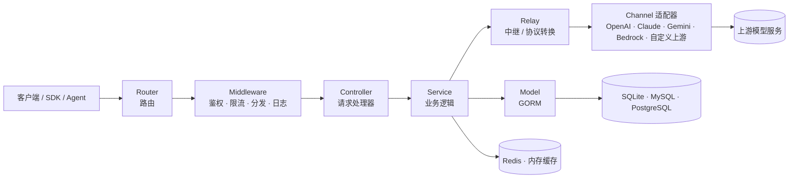

<div align="center">


# MAX API

🍥 **AI API 网关、AgentOps 与 AGI 应用服务基础设施**

<p align="center">
  <strong>简体中文</strong> |
  <a href="./README.zh_TW.md">繁體中文</a> |
  <a href="./README.md">English</a> |
  <a href="./README.fr.md">Français</a> |
  <a href="./README.ja.md">日本語</a>
</p>

<p align="center">
  <a href="https://raw.githubusercontent.com/MAX-API-Next/MAX-API/main/LICENSE">
    
  </a><!--
  --><a href="https://github.com/MAX-API-Next/MAX-API/releases/latest">
    
  </a><!--
  --><a href="https://hub.docker.com/r/max-api">
    
  </a><!--
  --><a href="https://goreportcard.com/report/github.com/MAX-API-Next/MAX-API">
    
  </a>
</p>

<p align="center">
  <a href="#-快速开始">快速开始</a> •
  <a href="#-项目定位">项目定位</a> •
  <a href="#-核心能力">核心能力</a> •
  <a href="#-架构概览">架构概览</a> •
  <a href="#-模型与接口支持">模型与接口</a> •
  <a href="#-部署">部署</a> •
  <a href="#-常见问题">FAQ</a> •
  <a href="#-许可证">许可证</a>
</p>

</div>

---

## 📝 项目说明

MAX API 是由来自科研机构的 AGI 爱好者组织发起、维护和长期运营的公益性研究项目，面向开发者、研究者、团队和组织提供稳定、可复用的 AI API 网关、AgentOps 与应用服务基础设施。项目关注 AI 应用落地中的模型接入、运营治理和 Agent 运行质量，在多模型、多供应商、多团队和多 Agent 应用并存的环境中，提供统一的接入、鉴权、路由、计费、观测和治理能力，让 AI 应用更稳定、更可控地运行。

持续投入方向：

- **国产模型与平台持续跟踪适配**：持续跟踪 DeepSeek、通义千问 / 阿里云百炼、智谱 GLM、Kimi、豆包 / 火山引擎、腾讯混元、百度文心 / 千帆、讯飞星火、MiniMax、零一万物、硅基流动等国产模型与平台的模型更新、接口变化、参数差异、价格规则和任务协议；通过内置渠道、兼容接口、路径覆盖和可配置任务协议降低接入成本。实际可用模型、模态和参数取决于上游授权、渠道类型和模型配置。
- **运营优化与计费治理**：持续优化渠道路由、失败重试、限流、预扣费、失败退款、日志观测、成本统计和运维分析；文本与多模态 token 场景可使用表达式计费，一行表达式即可定义阶梯定价、缓存命中、图像 / 音频分项、请求参数加价、分时折扣等规则；视频等异步任务场景可使用参数化 rate-card，按时长、质量、音频、视频输入等任务参数计费。
- **AgentOps 与 Agent 应用优化**：围绕 Agent、工作流和工具调用场景，持续完善令牌治理、模型访问控制、调用追踪、成本归因、异常定位和后续 MCP 风格服务编排基础，帮助 Agent 应用在真实业务中更可观测、更可运营。

> [!IMPORTANT]
> - 面向公众提供生成式人工智能服务时，使用者应遵守[《生成式人工智能服务管理暂行办法》](http://www.cac.gov.cn/2023-07/13/c_1690898327029107.htm)等监管要求，并自行完成所在司法辖区要求的备案、许可、内容安全、实名、日志留存、税务、支付和上游授权等合规义务。
> - 日志审计、内容留存等敏感能力应仅在具备合法依据、明确告知、权限隔离和数据安全措施的场景下启用。

---

## 🎯 项目定位

在 AGI 应用时代，MAX API 聚焦于开放的 AI API 网关和应用服务基础设施，建设让开发者和组织能够稳定运行 AI 应用与 Agent 工作负载的服务、治理和运营层：

- **统一 AI API 网关**：为大语言模型、图像生成、视频生成、音频、嵌入、重排序、实时交互等模型 API 提供统一入口。
- **AgentOps 控制台**：围绕 Agent 工作负载持续优化令牌治理、模型访问控制、调用日志、成本追踪、异常定位和运营分析。
- **协议与供应商适配层**：持续跟踪海外官方接口、国产模型平台接口（DeepSeek、通义、智谱、火山引擎、百度千帆等）以及各类 OpenAI 兼容 / 非标准接口的变化，并规范化为稳定的应用侧接口。
- **成本、额度与可靠性治理**：支持渠道路由、加权分发、失败重试、限流、预扣费、失败退款，以及表达式计费、固定价格、任务 rate-card、倍率计费和用量统计。
- **组织级服务运营层**：为团队、研究机构、企业和社区服务提供用户管理、分组管理、私有化部署、数据留存、审计和持续运营优化能力。
- **可复用生态模板**：沉淀渠道模板、任务协议模板、价格配置、部署实践和运维经验，降低新模型和新供应商接入成本。

---

## 🧩 适用场景

- **组织内部 AI 服务中台**：统一管理用户、令牌、模型、渠道、分组、权限和账单，避免每个团队重复接入上游服务。
- **Agent 应用运行底座**：为 Agent、工作流和工具调用应用提供稳定的模型网关、成本控制、调用观测、异常定位和后续治理优化基础。
- **多模态模型服务聚合**：统一接入文本、图像、视频、音频、嵌入、重排序、实时对话等接口，降低应用侧适配复杂度。
- **多供应商容灾与调度**：通过渠道权重、失败重试、模型映射和分组策略，在多个上游之间做弹性调度。
- **成本与额度治理平台**：围绕用户、令牌、模型、渠道和分组进行额度分配、费用核算、账单统计和成本分析。
- **私有化与合规部署**：适合需要自主管理密钥、数据、权限、日志、审计和计费策略的团队或机构。


---

## 🚀 快速开始

默认使用 SQLite，本地体验无需额外数据库。

```bash
# 1. 拉取镜像
docker pull max-api:latest

# 2. 启动服务，数据持久化到当前目录 ./data
docker run --name max-api -d --restart always \
  -p 3000:3000 \
  -e TZ=Asia/Shanghai \
  -v ./data:/data \
  max-api:latest

# 3. 访问控制台
# 浏览器打开 http://localhost:3000
```

生产部署建议使用 Docker Compose，并显式配置数据库、Redis、会话密钥、加密密钥和日志目录。

```bash
git clone https://github.com/MAX-API-Next/MAX-API.git
cd MAX-API

# 按需修改 docker-compose.yml 中的数据库、Redis 密码和环境变量
docker compose up -d
```

> [!WARNING]
> 将本项目作为面向公众的生成式 AI 服务或 API 服务运营时，应先完成上游授权、备案、内容安全、实名、日志留存、税务、支付和用户协议等合规事项。

---

## ✨ 核心能力

### AI API 网关

| 能力 | 说明 |
|------|------|
| 统一入口 | 支持 OpenAI 兼容接口、Responses、Claude Messages、Gemini、Realtime 等多种协议入口 |
| 多供应商聚合 | 海外可接入 OpenAI、Azure、Claude、Gemini、AWS Bedrock；国产方向持续跟踪并内置 DeepSeek、通义千问、智谱 GLM、Kimi、豆包、腾讯混元、文心、讯飞星火、MiniMax、零一万物、硅基流动等渠道适配 |
| 多模态接口 | 支持聊天、图像、视频、音频、嵌入、重排序、实时对话等场景 |
| 协议转换 | 支持 OpenAI Compatible、Claude Messages、Gemini 等格式之间的转换与适配 |
| 自定义上游 | 支持配置合法授权的上游地址、路径覆盖和任务协议解析规则 |

### AgentOps 与服务治理

| 能力 | 说明 |
|------|------|
| 令牌与权限 | 支持用户、令牌、分组、模型限制、额度限制和访问控制 |
| 调用观测 | 提供请求日志、用量统计、渠道命中、耗时、错误和重试信息 |
| 成本追踪 | 支持按模型、渠道、用户、分组和令牌维度统计成本与用量 |
| 管理员审计 | 私有部署场景可按合规要求启用管理员侧日志审计能力 |
| 运营优化 | 提供面向管理员的统计分析、用户管理、渠道管理、系统设置和运维分析能力 |

### 成本、计费与可靠性

**表达式计费（更直观的计价方式）**

- **一行表达式 = 一个 token 模型的完整计价规则**：阶梯定价、缓存命中、图像 / 音频 token 分项、分时折扣、按请求头或参数动态加价，全部写在同一行。
- **价格即真实价格**：系数直接填写「美元 / 百万 token」，`p * 2.5` 就是输入每百万 token 2.5 美元，适合按上游价格表维护成本；传统倍率模式仍保持兼容。
- **可视化 + 原始双模式编辑**：既可逐项填价格、按档位设条件，也可直接编辑表达式，并内置常见模型预设模板。
- **自动 token 归一**：按上游格式（OpenAI / Claude）和表达式实际用到的变量，自动从输入/输出中剥离缓存、图像、音频等子类别，避免重复计费；日志中可还原命中的计价档位与明细。

**任务计费、传统计费与可靠性**

- 支持视频等异步任务的参数化 rate-card 计费，按模型、供应商、时长、质量、音频、视频输入等字段匹配单价。
- 兼容按量、按次、缓存命中等计费模式，以及模型倍率、分组倍率、渠道倍率。
- 支持预扣费、失败退款、异常处理和消费日志。
- 支持渠道加权随机、失败重试、禁用渠道绕过和模型级路由。
- 支持 Redis 缓存与内存缓存，适配单机和多机部署。

### 安全与组织管理

- 支持 JWT、WebAuthn/Passkeys、OAuth、OIDC、Telegram、Discord、LinuxDO 等登录方式。
- 支持管理员、普通用户、分组、令牌和模型访问控制。
- 支持请求体大小限制、流式超时控制、错误日志和运行状态检查。
- 支持多机部署下的统一会话密钥、加密密钥和 Redis 共享缓存。

---

## 🆚 为什么使用网关

| 维度 | 直连各家官方 SDK / API | 通过 MAX API 网关 |
|------|------------------------|-------------------|
| 接入方式 | 每家一套 SDK、鉴权和参数 | 统一入口，一次接入，多模型复用 |
| 多模型切换 | 改代码、换 SDK、重新适配参数 | 修改模型名或渠道配置即可 |
| 协议差异 | 应用自行适配 Claude、Gemini、Responses 等格式 | 网关统一做协议转换和供应商适配 |
| 失败处理 | 应用自行实现重试、降级和错误归一 | 渠道失败自动重试、加权路由和错误处理 |
| 成本统计 | 各平台账单分散，难以按用户核算 | 统一额度、计费、用量统计和消费日志 |
| 访问控制 | 依赖各平台能力，粒度通常较粗 | 用户、令牌、分组、模型和渠道多维控制 |
| AgentOps | 应用侧自行记录调用和成本 | 网关层统一沉淀调用观测、审计和成本追踪 |
| 私有化 | 密钥、日志和计费策略分散 | 自托管，自主掌控密钥、数据、日志和策略 |

---

## 🧭 架构概览

MAX API 采用分层架构：客户端请求经统一入口进入，依次经过路由、中间件、控制器和业务服务层，最终由中继层适配到对应上游供应商；数据层和缓存层为鉴权、配置、计费、日志和任务状态提供持久化与加速能力。



### 目录结构

| 目录 | 职责 |
|------|------|
| `router/` | HTTP 路由，包含 API、relay、dashboard 和 web 入口 |
| `controller/` | 请求处理器，负责参数解析、鉴权后的业务入口和响应封装 |
| `service/` | 业务逻辑，包含日志、计费、审计、任务、渠道和系统配置等能力 |
| `model/` | 数据模型与数据库访问，基于 GORM 兼容 SQLite、MySQL、PostgreSQL |
| `relay/` | AI API 中继、协议转换和供应商适配 |
| `relay/channel/` | 各供应商适配器，如 openai、claude、gemini、aws 等 |
| `middleware/` | 鉴权、限流、CORS、日志、请求分发和上下文处理 |
| `setting/` | 倍率、模型、运营、系统、安全和性能配置 |
| `common/` | JSON、加密、Redis、限流、环境变量等共享工具 |
| `dto/` / `types/` | 请求、响应、错误和中继格式类型定义 |
| `constant/` | API 类型、渠道类型、上下文键等常量 |
| `i18n/` / `oauth/` / `pkg/` | 后端国际化、OAuth 实现和内部包 |
| `web/` | 前端主题容器，默认主题位于 `web/default/` |

### 技术栈

| 层 | 技术 |
|------|------|
| 后端 | Go 1.25+、Gin、GORM v2 |
| 前端 | React 19、TypeScript、Rsbuild、Base UI、Tailwind CSS |
| 包管理 | Bun workspace |
| 数据库 | SQLite / MySQL ≥ 5.7.8 / PostgreSQL ≥ 9.6 |
| 缓存 | Redis + 内存缓存 |
| 鉴权 | JWT、WebAuthn/Passkeys、OAuth、OIDC |

---

## 🤖 模型与接口支持

> 实际可用模型取决于你的上游授权、渠道配置、模型映射和服务商支持情况。

| 类型 | 说明 |
|------|------|
| OpenAI-Compatible | Chat Completions、Embeddings、Images、Audio 等兼容接口 |
| OpenAI Responses | Responses 格式请求、中继与兼容能力 |
| Claude Messages | Claude Messages 格式与 OpenAI 兼容格式转换 |
| Google Gemini | Gemini 聊天、文本和部分转换能力 |
| Azure OpenAI | Azure OpenAI 与 Realtime 相关接口 |
| AWS Bedrock | Bedrock Runtime 相关模型接入 |
| 国产模型与平台 | 内置 DeepSeek、通义千问 / 阿里云百炼、智谱 GLM、Kimi、豆包 / 火山引擎、腾讯混元、百度文心 / 千帆、讯飞星火、MiniMax、零一万物、硅基流动等适配器或兼容接入能力 |
| Rerank | Cohere、Jina 等重排序模型 |
| Midjourney / Suno / Dify | 图像、音乐、工作流等第三方服务适配 |
| 视频任务接口 | 支持视频生成任务的提交、轮询、状态映射和结果代理 |
| 自定义上游 | 支持配置合法授权的上游接口地址和协议适配规则 |

### 支持的主要接口

<details>
<summary>查看接口类别</summary>

- 聊天接口：`/v1/chat/completions`
- 响应接口：`/v1/responses`
- 图像接口：`/v1/images/*`
- 音频接口：`/v1/audio/*`
- 视频接口：`/v1/videos/*`
- 嵌入接口：`/v1/embeddings`
- 重排序接口：`/v1/rerank`
- 实时对话：OpenAI Realtime 兼容接口
- Claude Messages：Claude 原生格式入口
- Gemini：Google Gemini 格式入口

</details>

### Reasoning Effort 支持

<details>
<summary>查看示例模型命名</summary>

**OpenAI 系列：**

- `o3-mini-high`
- `o3-mini-medium`
- `o3-mini-low`
- `gpt-5-high`
- `gpt-5-medium`
- `gpt-5-low`

**Claude 思考模型：**

- `claude-3-7-sonnet-20250219-thinking`

**Gemini 系列：**

- `gemini-2.5-flash-thinking`
- `gemini-2.5-flash-nothinking`
- `gemini-2.5-pro-thinking`
- `gemini-2.5-pro-thinking-128`
- 也可以在 Gemini 模型名后追加 `-low`、`-medium`、`-high` 来控制思考力度。

</details>

---

## 🔧 管理与配置

### 初始配置建议

1. 部署完成后进入控制台，创建或确认管理员账号。
2. 配置系统设置、用户注册策略、登录方式和安全限制。
3. 添加上游渠道，填写合法授权的 API Key、Base URL、模型列表、模型映射和渠道设置。
4. 根据组织结构配置用户分组、令牌分组、模型限制、额度策略和价格规则。
5. 在运营设置中配置失败重试、日志记录、缓存策略和消费统计。
6. 如需管理员侧内容审计，应在合规前提下启用日志审计，并确保“记录配额使用量”已开启。

### 常见运维入口

| 功能 | 说明 |
|------|------|
| 渠道管理 | 配置上游供应商、模型映射、渠道权重、密钥和状态 |
| 令牌管理 | 为应用、Agent 或用户创建访问令牌并限制模型与额度 |
| 用户管理 | 管理用户、分组、余额、权限和状态 |
| 使用日志 | 查看调用记录、消耗、耗时、错误、渠道命中和审计信息 |
| 系统设置 | 管理安全限制、模型定价、任务计费、运营策略、日志维护、支付和站点配置 |
| 数据看板 | 查看整体请求量、模型用量、消费趋势和渠道状态 |

---

## 🚢 部署

### 部署要求

| 组件 | 要求 |
|------|------|
| 容器引擎 | Docker / Docker Compose |
| 本地数据库 | SQLite，Docker 部署时需挂载 `/data` |
| 远程数据库 | MySQL ≥ 5.7.8 或 PostgreSQL ≥ 9.6 |
| 缓存 | 单机可使用内存缓存，多机部署建议使用 Redis |
| 前端构建 | 使用 Bun workspace，需保留 `web/package.json` 与 `web/bun.lock` |

### 推荐环境变量

<details>
<summary>查看常用环境变量</summary>

| 变量名 | 说明 | 默认值 |
|--------|------|--------|
| `SESSION_SECRET` | 会话密钥，多机部署必须设置 | - |
| `CRYPTO_SECRET` | 加密密钥，使用 Redis 或多机部署时必须设置 | - |
| `SQL_DSN` | 数据库连接字符串 | - |
| `REDIS_CONN_STRING` | Redis 连接字符串 | - |
| `STREAMING_TIMEOUT` | 流式响应超时时间，单位秒 | `300` |
| `STREAM_SCANNER_MAX_BUFFER_MB` | 流式扫描器单行最大缓冲，图像 base64 等大响应可适当调大 | `64` |
| `MAX_REQUEST_BODY_MB` | 请求体最大大小，按解压后大小计算，超出返回 `413` | `32` |
| `AZURE_DEFAULT_API_VERSION` | Azure API 默认版本 | `2025-04-01-preview` |
| `ERROR_LOG_ENABLED` | 错误日志开关 | `false` |
| `NODE_NAME` | 节点名称，多机部署时便于日志定位 | - |
| `PYROSCOPE_URL` | Pyroscope 服务地址 | - |
| `PYROSCOPE_APP_NAME` | Pyroscope 应用名 | `max-api` |
| `PYROSCOPE_BASIC_AUTH_USER` | Pyroscope Basic Auth 用户名 | - |
| `PYROSCOPE_BASIC_AUTH_PASSWORD` | Pyroscope Basic Auth 密码 | - |
| `PYROSCOPE_MUTEX_RATE` | Pyroscope mutex 采样率 | `5` |
| `PYROSCOPE_BLOCK_RATE` | Pyroscope block 采样率 | `5` |
| `HOSTNAME` | Pyroscope 标签中的主机名 | `max-api` |

</details>

### Docker Compose

```bash
git clone https://github.com/MAX-API-Next/MAX-API.git
cd MAX-API

# 修改 docker-compose.yml：
# - 更换 PostgreSQL / MySQL / Redis 默认密码
# - 按需设置 SESSION_SECRET、CRYPTO_SECRET、NODE_NAME
# - 生产环境建议配置反向代理与 HTTPS
docker compose up -d
```

### Docker 命令

**SQLite：**

```bash
docker run --name max-api -d --restart always \
  -p 3000:3000 \
  -e TZ=Asia/Shanghai \
  -v ./data:/data \
  max-api:latest
```

**MySQL：**

```bash
docker run --name max-api -d --restart always \
  -p 3000:3000 \
  -e SQL_DSN="root:123456@tcp(mysql:3306)/max-api" \
  -e TZ=Asia/Shanghai \
  -v ./data:/data \
  max-api:latest
```

### 从源码构建镜像

```bash
git clone https://github.com/MAX-API-Next/MAX-API.git
cd MAX-API
docker build -t max-api:latest .
```

> [!TIP]
> 前端使用 Bun workspace。构建上下文中必须保留 `web/package.json`、`web/bun.lock` 和 `web/default/package.json`，否则 `catalog:` 依赖无法解析。

### 多机部署注意事项

> [!WARNING]
> - 必须设置相同的 `SESSION_SECRET`，否则不同节点之间登录状态不一致。
> - 使用共享 Redis 时必须设置相同的 `CRYPTO_SECRET`，否则加密数据无法解密。
> - 多节点建议设置 `NODE_NAME`，便于在日志和审计信息中定位来源节点。
> - 生产环境应使用外部数据库、外部 Redis、HTTPS 反向代理和可靠的备份策略。

---

## 🗺️ 路线图

以下为方向性规划，会根据维护节奏、真实场景和社区需求调整，不构成时间承诺。

- **AgentOps 深化**：围绕 Agent、工具调用、工作流和 MCP 风格服务编排，持续优化调用链路、成本归因、异常定位和治理能力。
- **多模态任务治理**：增强图像、视频、音频和实时交互任务的计费、限流、状态追踪和结果代理。
- **协议转换增强**：持续完善 OpenAI Compatible、Responses、Claude Messages、Gemini 等协议之间的转换。
- **国产模型与平台跟踪适配**：跟进国产模型、云平台、价格规则和 API 协议变化，沉淀可复用的渠道、价格和任务协议配置。
- **供应商适配模板化**：让路径覆盖、任务协议、状态映射、错误解析和结果解析更容易配置和复用。
- **运营优化与审计**：完善请求链路、成本追踪、错误分析、管理员审计和运维报表。
- **组织级运营能力**：增强多租户、分组、账单、权限、风控和私有化部署体验。

欢迎在 [GitHub Issues](https://github.com/MAX-API-Next/MAX-API/issues) 提出需求、问题和改进建议。

---

## ❓ 常见问题

<details>
<summary><strong>MAX API 会提供模型服务或 API Key 吗？</strong></summary>

不会。MAX API 是网关和治理层，不提供上游模型账号、API Key 或模型服务本身。使用者需要自行获得合法授权的上游服务。

</details>

<details>
<summary><strong>支持哪些数据库？</strong></summary>

支持 SQLite、MySQL ≥ 5.7.8 和 PostgreSQL ≥ 9.6。本地体验可使用 SQLite；生产环境建议使用 MySQL 或 PostgreSQL，并做好备份。

</details>

<details>
<summary><strong>能否从 New API / One API 迁移？</strong></summary>

项目兼容 New API 与原版 One API 的主要数据结构，通常可以复用既有数据。迁移前仍建议备份数据库，并在测试环境验证渠道、倍率、用户、令牌和日志数据。

</details>

<details>
<summary><strong>多机部署需要注意什么？</strong></summary>

必须统一 `SESSION_SECRET`。如果使用共享 Redis，也必须统一 `CRYPTO_SECRET`。否则可能出现登录状态不一致、缓存数据无法解密或任务状态异常。

</details>

<details>
<summary><strong>图像生成、流式响应或大响应被截断怎么办？</strong></summary>

可调大 `STREAM_SCANNER_MAX_BUFFER_MB`。4K 图像、base64 图片、长流式响应等场景可能需要更大的扫描缓冲。

</details>

<details>
<summary><strong>请求体过大返回 413 怎么办？</strong></summary>

调整 `MAX_REQUEST_BODY_MB`。该限制按解压后的请求体大小计算，用于防止超大请求或 zip bomb 导致内存暴涨。

</details>

<details>
<summary><strong>用户能看到管理员日志审计中的输入输出内容吗？</strong></summary>

正常用户日志接口会过滤管理员专用字段，普通用户无法在自助使用日志中看到管理员审计内容。数据库管理员、系统管理员或拥有管理员日志接口权限的人仍可能访问相关数据，因此应按合规要求严格控制权限。

</details>

<details>
<summary><strong>为什么 Docker 构建时提示 `catalog:` 依赖无法解析？</strong></summary>

前端使用 Bun workspace，`catalog:` 依赖定义在 `web/package.json`。构建时不能用 `web/default/package.json` 覆盖 workspace 根 `package.json`，并且需要保留 `web/bun.lock`。

</details>

---

## 🔗 相关项目

| 项目 | 说明 |
|------|------|
| [One API](https://github.com/songquanpeng/one-api) | 原版项目基础，MIT 协议 |
| [New API](https://github.com/QuantumNous/new-api) | 原版项目基础，AGPLv3 协议 |
| [Midjourney-Proxy](https://github.com/novicezk/midjourney-proxy) | Midjourney 接口支持，Apache-2.0 协议 |
| [Suno API](https://github.com/Suno-API/Suno-API) | Suno 相关接口支持 |

### 配套工具

| 项目 | 说明 |
|------|------|
| [max-api-key-tool](https://github.com/MAX-API-Next/MAX-API-key-tool) | Key 额度查询工具 |
| [max-api-horizon](https://github.com/MAX-API-Next/MAX-API-horizon) | MAX API 高性能优化版 |

---

## 📚 文档与支持

| 资源 | 链接 |
|------|------|
| 官方文档 | [MAX-API-Next/MAX-API](https://github.com/MAX-API-Next/MAX-API) |
| 问题反馈 | [GitHub Issues](https://github.com/MAX-API-Next/MAX-API/issues) |
| 最新发布 | [Releases](https://github.com/MAX-API-Next/MAX-API/releases) |
| DeepWiki | [Ask DeepWiki](https://deepwiki.com/MAX-API-Next/MAX-API) |

欢迎提交 Issue、改进文档、补充供应商适配经验、完善部署方案或贡献代码。

---

## 📜 许可证

本项目采用 [GNU Affero 通用公共许可证 v3.0 (AGPLv3)](./LICENSE) 授权。

如果你修改并通过网络向用户提供本项目服务，请理解并遵守 AGPLv3 对应源码提供等义务。商业合作、机构合作或其他授权问题，请联系：maxapi@max-api.ai。

---

## 🌟 Star History

<div align="center">

[](https://star-history.com/#MAX-API-Next/MAX-API&Date)

</div>

---

<div align="center">

### 💖 感谢使用 MAX API

如果这个项目对你有帮助，欢迎给我们一个 ⭐ Star。

**[官方文档](https://github.com/MAX-API-Next/MAX-API)** • **[问题反馈](https://github.com/MAX-API-Next/MAX-API/issues)** • **[最新发布](https://github.com/MAX-API-Next/MAX-API/releases)**

<sub>Built with ❤️ by MAX-API-Next</sub>

</div>
